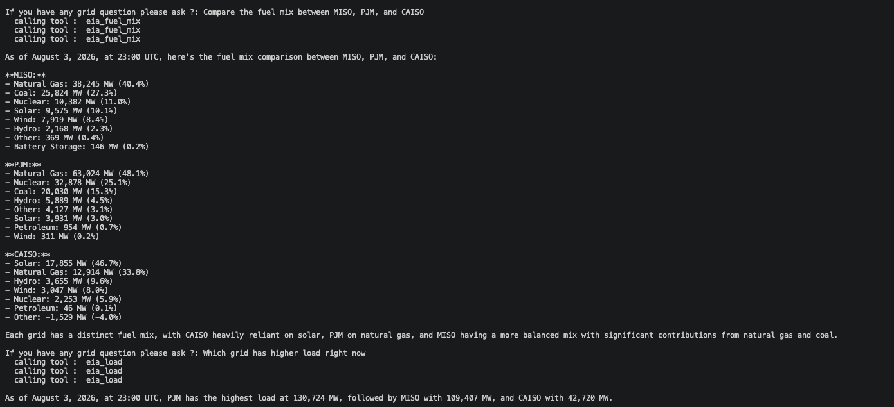
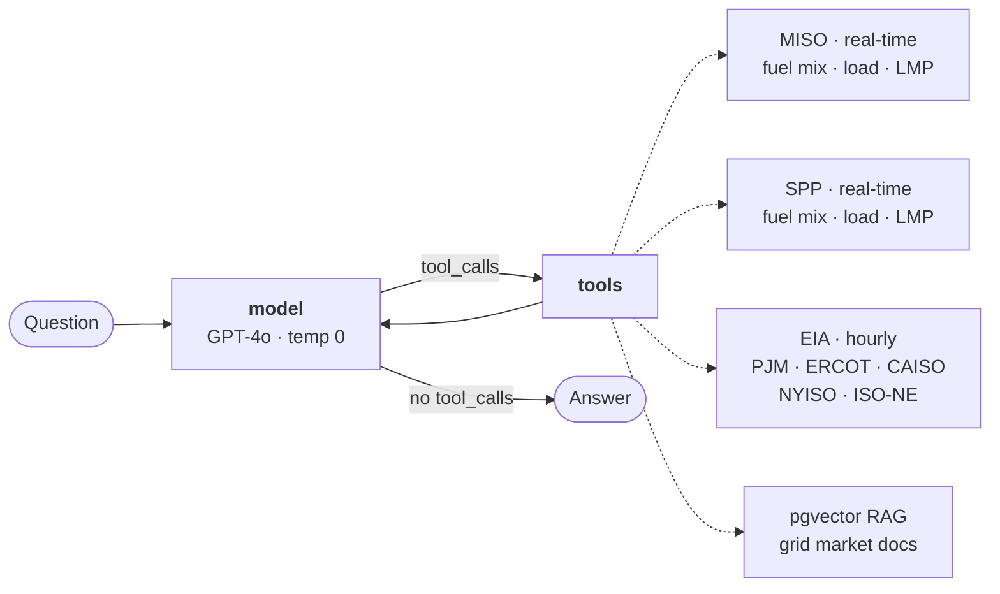
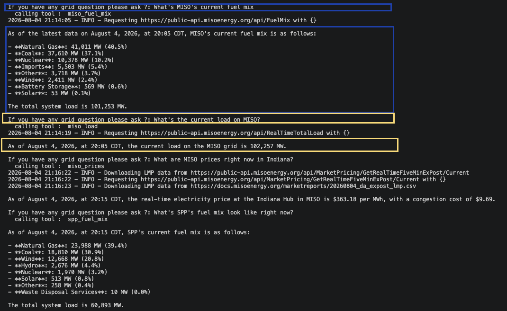

<h1 align="center">ISO Agent</h1>

<p align="center">
  <i>Ask the US power grid a question in plain English. Get an answer off live market data.</i>
</p>

<p align="center">
  
  
  
  
</p>

---

<p align="center">
  
</p>

<p align="center">
  <sub>One question, three parallel EIA calls — all three grids pulled from the same source so the numbers are actually comparable.</sub>
</p>

<!-- Replace the still above with a terminal GIF when you have one — it autoplays inline:
         
     For video, drag the .mp4 into the GitHub web editor for this file and paste the
     resulting user-attachments URL on its own line; a committed .mp4 renders as a
     link, not a player. -->

## What it is

Grid data lives behind a handful of unfriendly ISO feeds, and reading a number off one
of them doesn't tell you *why* it looks the way it does. ISO Agent is a LangGraph ReAct
agent that closes both halves: it pulls the live number, then grounds the explanation in
market documentation.

Ask it *"what's the price in Indiana right now"* and it hits the MISO real-time LMP feed.
Ask it *"why is it higher than the hub"* and it retrieves the passage on congestion and
answers from it. Ask it to compare MISO to ERCOT and it deliberately routes both sides
through EIA so the numbers are actually comparable.

## How it works



The loop is the standard ReAct shape — the model decides, tools execute, control returns
to the model, and it exits only when it stops asking for tools. An `InMemorySaver`
checkpointer keeps the thread, so follow-up questions carry context.

**Nine tools, three tiers:**

| Tier | Tools | Covers | Latency |
| :--- | :--- | :--- | :--- |
| Native | `miso_fuel_mix` · `miso_load` · `miso_prices`<br>`spp_fuel_mix` · `spp_load` · `spp_prices` | MISO, SPP | real-time (5 min), **includes prices** |
| Fallback | `eia_fuel_mix` · `eia_load` | PJM, ERCOT, CAISO, NYISO, ISO-NE<br>(+ MISO/SPP, for comparisons) | hourly, ~1–2 h lag, no prices |
| Grounding | `explain_grid_concept` | LMP, congestion, price drivers,<br>MISO business practices | pgvector similarity search |

Price tools return the **congestion component broken out** alongside the LMP, which is
what makes "why is this node expensive" answerable rather than a guess.

### Design notes

- **Comparisons force a single source.** Mixing a 5-minute MISO reading against an
  hour-lagged EIA reading produces a difference that's partly just clock skew. The system
  prompt routes every ISO in a comparison through EIA so the timestamps line up.
- **Caching is keyed to each feed's own refresh interval** — 300 s for MISO/SPP, 1000 s
  for EIA ([`cache_utils.py`](cache_utils.py)). Follow-ups in a session don't re-download
  the same dataset, and nothing served is meaningfully stale, because the upstream hadn't
  changed anyway.
- **Chunk IDs are stable across re-ingests.** `sha256(source:index)` means running
  `--ingest` again upserts instead of duplicating, even where two chunks share identical
  text — repeated PDF headers and footers otherwise pile up silently.
- **Every answer reports its interval timestamp.** Grid data without a timestamp is
  unfalsifiable.

## Setup

```bash
git clone https://github.com/chy0010/ISO_Agent.git
cd ISO_Agent
python -m venv .venv && source .venv/bin/activate
pip install -r requirements.txt
```

You need Postgres with the `pgvector` extension for the RAG tool:

```bash
createdb griddb
psql griddb -c "CREATE EXTENSION IF NOT EXISTS vector;"
```

Create a `.env`:

```bash
OPENAI_API_KEY=sk-...
EIA_API_KEY=...          # free at https://www.eia.gov/opendata/register.php
POSTGRES_URL=postgresql+psycopg://localhost:5432/griddb
```

Load the documents into pgvector — once, before first run:

```bash
python grid_rag.py --ingest
```

## Run

```bash
python graph.py
```

A real session, evening peak on August 4, 2026:

```
If you have any grid question please ask ?: What's the current load on MISO?
  calling tool :  miso_load

As of August 4, 2026, at 20:05 CDT, the current load on the MISO grid is 102,257 MW.

If you have any grid question please ask ?: What are MISO prices right now in Indiana?
  calling tool :  miso_prices

As of August 4, 2026, at 20:15 CDT, the real-time electricity price at the Indiana Hub
in MISO is $363.18 per MWh, with a congestion cost of $9.69.

If you have any grid question please ask ?: What's SPP's fuel mix look like right now?
  calling tool :  spp_fuel_mix

As of August 4, 2026, at 20:15 CDT, SPP's current fuel mix is as follows:

- **Natural Gas**: 23,988 MW (39.4%)
- **Coal**: 18,810 MW (30.9%)
- **Wind**: 12,668 MW (20.8%)
- **Hydro**: 2,676 MW (4.4%)
- **Nuclear**: 1,970 MW (3.2%)
- **Solar**: 513 MW (0.8%)
- **Other**: 258 MW (0.4%)
- **Waste Disposal Services**: 10 MW (0.0%)
```

<p align="center">
  
</p>

That $363/MWh is roughly ten times a normal off-peak price — an evening scarcity event,
with only $9.69 of it coming from congestion, so the cost is systemwide rather than a
local transmission constraint. Asking `why are prices so high right now?` routes to
`explain_grid_concept` and answers from the price-drivers documentation.

Each module also runs standalone for a quick smoke test:

```bash
python miso_tools.py
python spp_tools.py
python eia_tools.py
python grid_rag.py
```

## Try asking

| | |
| :--- | :--- |
| `what's the load in SPP right now?` | native real-time feed |
| `show me MISO prices in Indiana` | LMP with congestion component |
| `why are prices different across locations?` | RAG grounding |
| `compare wind generation in SPP and ERCOT` | routed through EIA for comparability |
| `what does LMP actually mean?` | RAG grounding |
| `is ERCOT running more gas than CAISO?` | EIA, both sides |

## Data sources

- **[gridstatus](https://github.com/gridstatus/gridstatus)** — MISO and SPP real-time feeds, and the EIA client
- **[EIA Open Data](https://www.eia.gov/opendata/)** — `electricity/rto/fuel-type-data`, `electricity/rto/region-data`
- **`grid_docs/`** — curated notes on LMP, congestion, fuel mix and load, market structure, and price drivers, plus a MISO Business Practices Manual

## Roadmap

- [ ] Day-ahead prices and DA/RT spread
- [ ] Historical windows, not just `latest` — "how did today compare to last Tuesday"
- [ ] Citations surfaced in the answer, not just retrieved behind it
- [ ] Web UI over the current terminal REPL
